<h3 align="center">
Neovim Configuration with Lua and LSP
</h3>

<p align="center">
A modern, fully-featured Neovim configuration with LSP support, tmux integration, and a beautiful UI.
</p>

---

## Table of Contents

- [Features](#-features)
- [Requirements](#-requirements)
- [Installation](#-installation)
- [Tmux Integration Setup](#-tmux-integration-setup)
- [Key Bindings](#-key-bindings)
- [Colorschemes](#-colorschemes)
- [Configuration Structure](#-configuration-structure)
- [Language Server Setup](#-language-server-setup)
- [Customization](#-customization)
- [Troubleshooting](#-troubleshooting)
- [Configuration Check](#-configuration-check)
- [Resources](#-resources)
- [Plugins](#plugins)
- [Contributing](#-contributing)
- [Disclaimer](#disclaimer)
- [Thanks](#-thanks)

## 📸 Screenshots

<div align="center">

### Alpha Dashboard

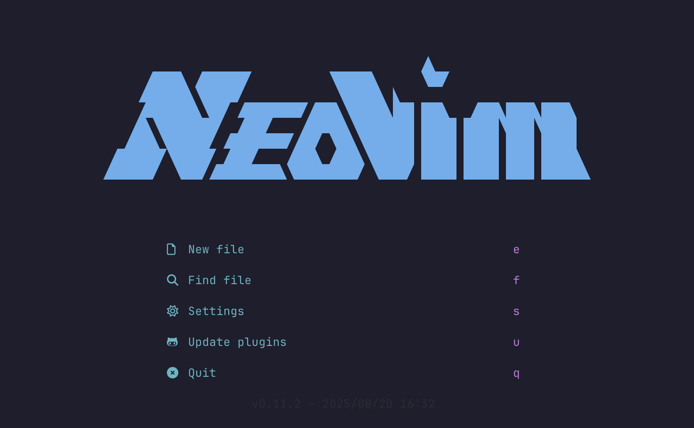

<details>
<summary><strong>🖼️ View More Screenshots</strong></summary>

<br>

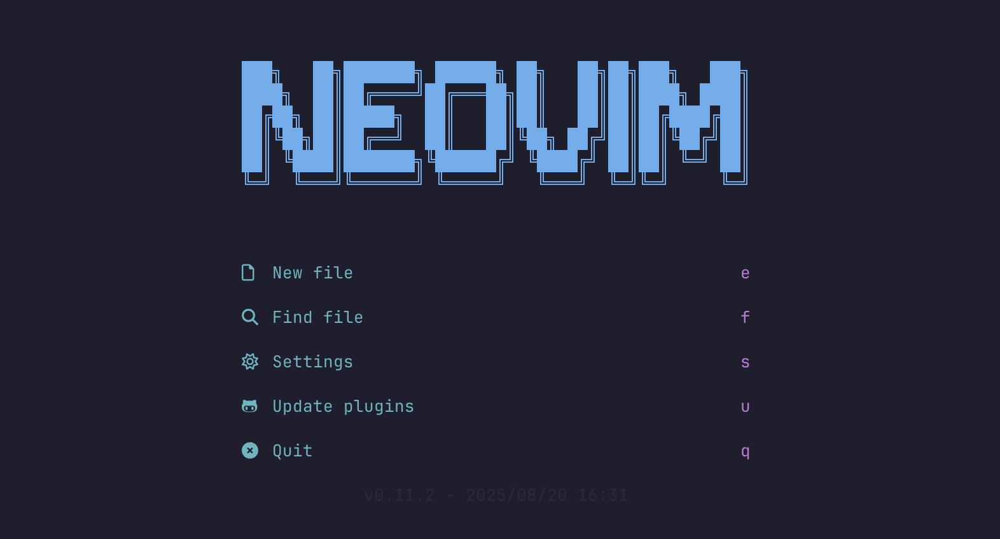 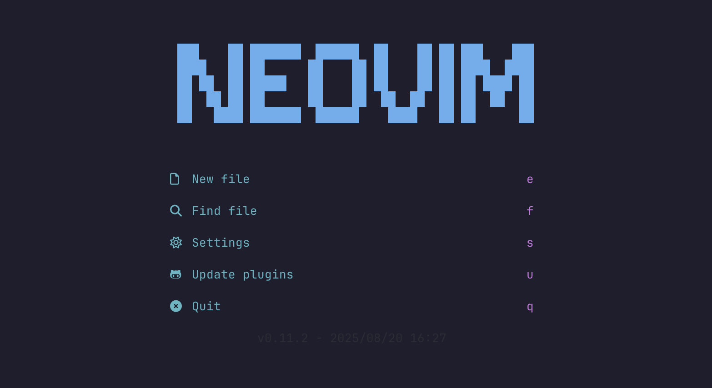

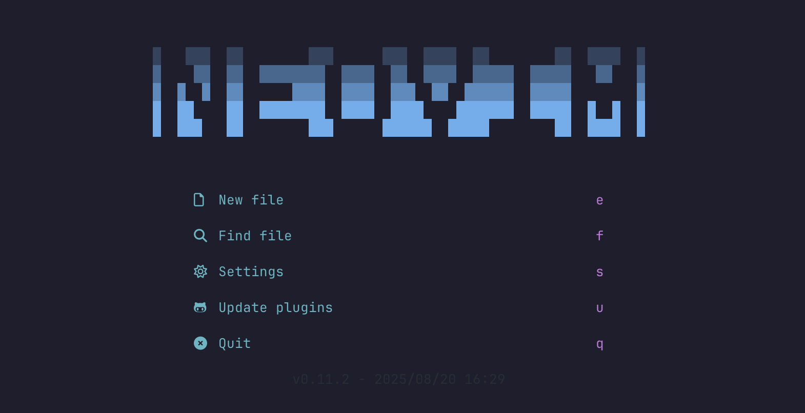 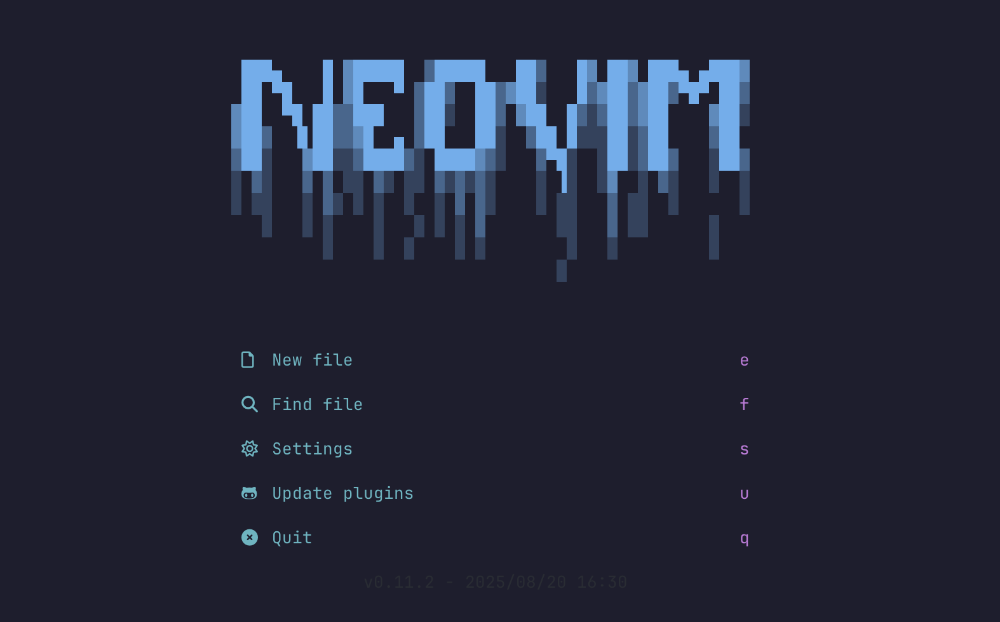

 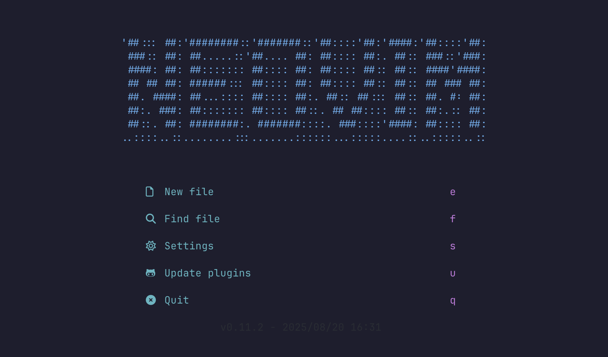

</details>

<div style="text-align: center; background: linear-gradient(90deg, transparent, #ddd, transparent); height: 1px; margin: 20px 0;"></div>

### Colorschemes

**🐱 Catppuccin** (Default)

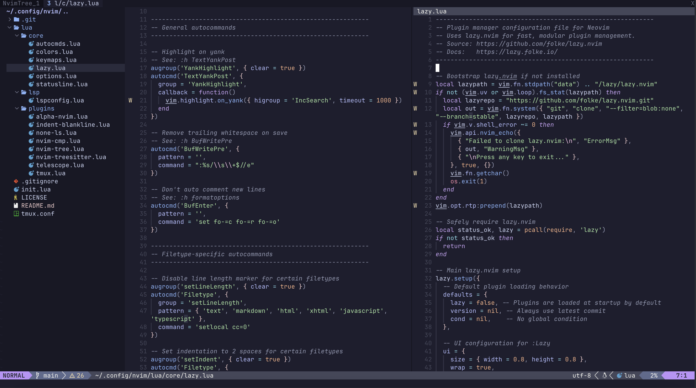

<details>
<summary><strong>🎨 View More Colorschemes</strong></summary>

<br>

<div style="text-align: center; background: linear-gradient(90deg, transparent, #ddd, transparent); height: 1px; margin: 20px 0;"></div>

**🌙 OneDark**

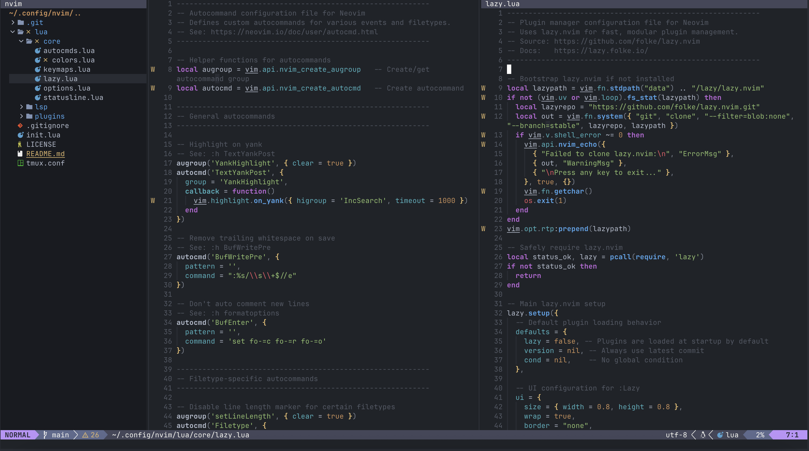

<div style="text-align: center; background: linear-gradient(90deg, transparent, #ddd, transparent); height: 1px; margin: 20px 0;"></div>

**🌸 Kanagawa**

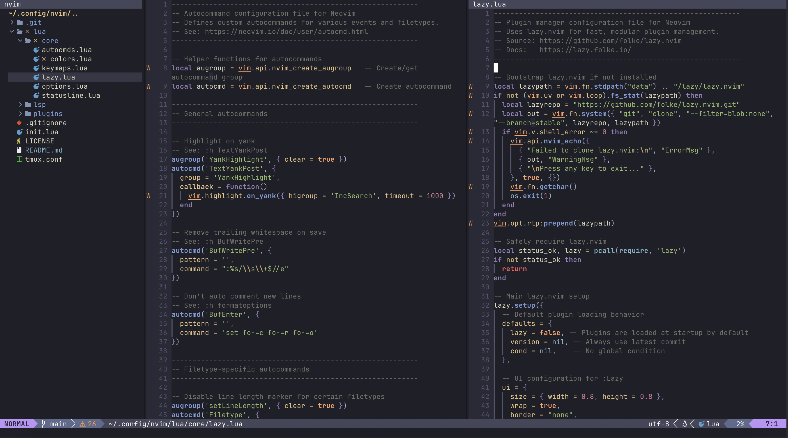

<div style="text-align: center; background: linear-gradient(90deg, transparent, #ddd, transparent); height: 1px; margin: 20px 0;"></div>

**🔥 Monokai Pro**

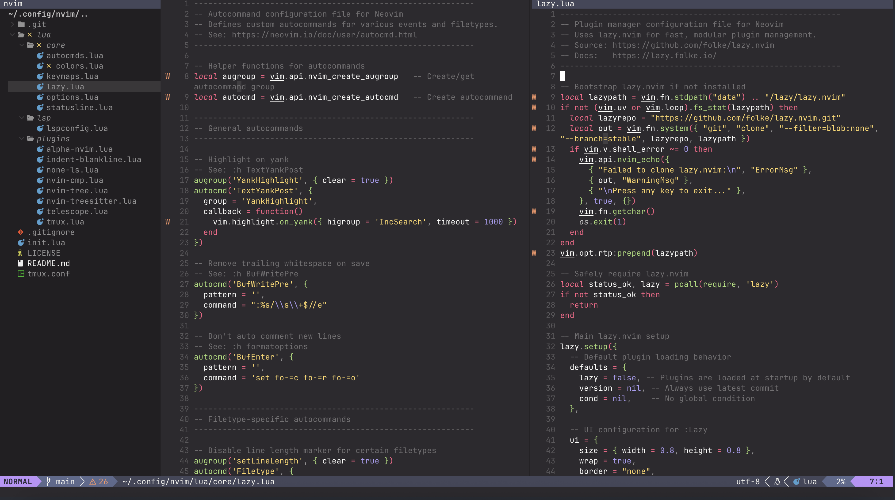

<div style="text-align: center; background: linear-gradient(90deg, transparent, #ddd, transparent); height: 1px; margin: 20px 0;"></div>

**🌹 Rose Pine**

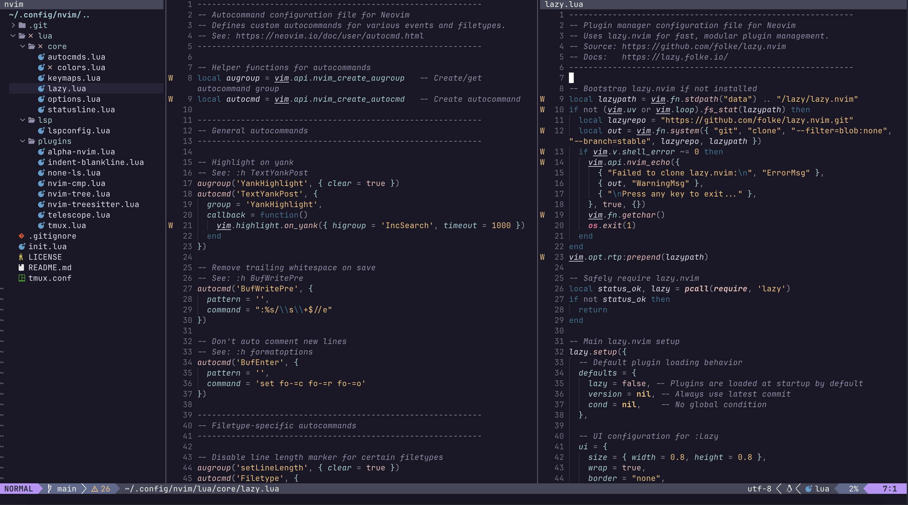

</details>

</div>

## ✨ Features

- **🚀 Fast startup** with lazy loading via [lazy.nvim](https://github.com/folke/lazy.nvim)
- **🔍 LSP support** with auto-completion, diagnostics, and code actions
- **📁 File explorer** with [nvim-tree](https://github.com/kyazdani42/nvim-tree.lua)
- **🔭 Fuzzy finder** with [telescope.nvim](https://github.com/nvim-telescope/telescope.nvim)
- **🎨 Multiple colorschemes** (Catppuccin, OneDark, Kanagawa, etc.)
- **🔄 Tmux integration** for seamless navigation
- **📊 Status line** with git integration
- **🌳 Treesitter** for enhanced syntax highlighting
- **🎯 Auto-completion** with nvim-cmp
- **🛠️ External tools** integration with Mason

## 📋 Requirements

### Core Requirements
- **Neovim** >= 0.11.0 (uses the native `vim.lsp` configuration API)
- **Git** (for plugin management)
- **Node.js** (for LSP servers)
- **Python** (for LSP servers)

### Optional but Recommended
- **tmux** (for tmux integration)
- **ripgrep** (for telescope live grep functionality)
- **fd** (for faster telescope file finding)
- **wget** (for Mason package downloads)

### Installation Commands

**macOS (Homebrew):**
```bash
# Core tools
brew install neovim git node python3

# Optional tools
brew install tmux ripgrep fd wget
```

**Ubuntu/Debian:**
```bash
# Core tools
sudo apt update
sudo apt install neovim git nodejs npm python3 python3-pip

# Optional tools
sudo apt install tmux ripgrep fd-find wget
```

**Arch Linux:**
```bash
# Core tools
sudo pacman -S neovim git nodejs npm python python-pip

# Optional tools
sudo pacman -S tmux ripgrep fd wget
```

## 🚀 Installation

1. **Backup your existing configuration** (if any):

   ```bash
   mv ~/.config/nvim ~/.config/nvim.backup
   ```

2. **Clone this repository**:

   ```bash
   git clone https://github.com/CollatzConjecture/neovim-lua ~/neovim-config
   ```

3. **Copy the nvim configuration**:

   ```bash
   cp -r ~/neovim-config/nvim ~/.config/nvim
   ```

4. **Start Neovim**:

   ```bash
   nvim
   ```

   The configuration will automatically:

   - Install the plugin manager (lazy.nvim)
   - Download and install all plugins
   - Set up LSP servers via Mason

## 🔧 Tmux Integration Setup

This configuration includes a beautiful oh-my-tmux setup with colorful status bar, powerline separators, and vim integration.

### Complete Tmux Setup

1. **Copy both tmux configuration files**:

   ```bash
   # Main oh-my-tmux configuration
   cp ~/neovim-config/nvim/tmux.conf ~/.config/tmux/tmux.conf

   # Custom local configuration with colorful theme
   cp ~/neovim-config/nvim/tmux.conf.local ~/.config/tmux/tmux.conf.local
   ```

   Or if you've already copied the nvim folder:

   ```bash
   mkdir -p ~/.config/tmux
   cp ~/.config/nvim/tmux.conf ~/.config/tmux/tmux.conf
   cp ~/.config/nvim/tmux.conf.local ~/.config/tmux/tmux.conf.local
   ```

2. **Reload tmux configuration**:

   ```bash
   tmux source-file ~/.config/tmux/tmux.conf
   ```

### Features

- **🎨 Colorful status bar** with oh-my-tmux theming
- **⚡ Battery indicator** with colorful gradient bar
- **📡 Powerline separators** with angled shapes
- **🚀 Vim integration** with vim-tmux-navigator
- **⌨️ Vi mode keys** in copy mode
- **🖱️ Mouse support** enabled

### Key Bindings

**Prefix Key**: `Ctrl + a` (changed from default `Ctrl + b`)

**Window Management**:
- `Ctrl + a` + `c` - Create new window
- `Ctrl + a` + `|` - Split window horizontally
- `Ctrl + a` + `-` - Split window vertically
- `Ctrl + a` + `Ctrl + h` - Previous window
- `Ctrl + a` + `Ctrl + l` - Next window
- `Alt + 1-9` - Jump directly to window 1-9

**Pane Navigation** (works seamlessly with Neovim):
- `Ctrl + h` - Move left (pane/vim split)
- `Ctrl + j` - Move down (pane/vim split)
- `Ctrl + k` - Move up (pane/vim split)
- `Ctrl + l` - Move right (pane/vim split)

**Copy Mode** (vim-style):
- `Ctrl + a` + `[` - Enter copy mode
- `h/j/k/l` - Navigate with vim motions
- `v` - Start visual selection
- `y` - Copy selection
- `/` and `?` - Search

**Session Management**:
- `Ctrl + a` + `N` - Create new session
- `Ctrl + a` + `X` - Kill current session

The integration automatically detects whether you're in Neovim or tmux and navigates accordingly.

## ⌨️ Key Bindings

### Leader Keys

- **Leader**: `Space`
- **Local Leader**: `\`

### Core Navigation

- `kk` - Exit insert mode
- `<leader>c` - Clear search highlighting
- `<leader>r` - Reload configuration
- `<leader>s` - Save file
- `<leader>q` - Quit all

### File Management

- `<leader>e` - Toggle file explorer
- `<leader>f` - Refresh file explorer
- `<leader>n` - Find current file in explorer

### Fuzzy Finding (Telescope)

- `<leader>ff` - Find files
- `<leader>fg` - Live grep
- `<leader>fb` - List buffers
- `<leader>fh` - Help tags

### LSP Features

- `gd` - Go to definition
- `gD` - Go to declaration
- `gi` - Go to implementation
- `gr` - Find references
- `K` - Show hover documentation
- `<leader>rn` - Rename symbol
- `<leader>ca` - Code actions
- `<leader>f` - Format code
- `gl` - Show line diagnostics
- `[d` - Previous diagnostic
- `]d` - Next diagnostic

### Terminal

- `Ctrl + t` - Open terminal
- `Esc` - Exit terminal mode (in terminal)

## 🎨 Colorschemes

Available colorschemes:

- **Catppuccin** (default)
- **OneDark**
- **Kanagawa**
- **Monokai Pro**
- **Rose Pine**

Switch colorschemes by editing `lua/core/colors.lua`.

## 🔧 Configuration Structure

```
Repository Structure:
├── img/                    # Documentation images
├── nvim/                   # Neovim configuration folder
│   ├── lua/
│   │   ├── core/
│   │   │   ├── autocmds.lua    # Auto-commands
│   │   │   ├── colors.lua      # Colorscheme configuration
│   │   │   ├── keymaps.lua     # Key mappings
│   │   │   ├── lazy.lua        # Plugin manager setup
│   │   │   ├── options.lua     # Neovim options
│   │   │   └── statusline.lua  # Status line configuration
│   │   ├── lsp/
│   │   │   └── lspconfig.lua   # LSP configuration
│   │   └── plugins/
│   │       ├── alpha-nvim.lua  # Dashboard
│   │       ├── indent-blankline.lua
│   │       ├── none-ls.lua     # External formatters/linters
│   │       ├── nvim-cmp.lua    # Auto-completion
│   │       ├── nvim-tree.lua   # File explorer
│   │       ├── nvim-treesitter.lua
│   │       ├── telescope.lua   # Fuzzy finder
│   │       └── tmux.lua        # Tmux integration
│   ├── init.lua            # Entry point
│   └── tmux.conf           # Tmux configuration template
├── .gitignore
├── LICENSE
└── README.md

After Installation (~/.config/nvim/):
├── lua/
│   ├── core/              # Core configuration files
│   ├── lsp/               # LSP configuration
│   └── plugins/           # Plugin configurations
├── init.lua                # Entry point
└── tmux.conf              # Tmux configuration template
```

## 🛠️ Language Server Setup

The configuration automatically installs LSP servers for:

- **Bash** (bashls)
- **Python** (pyright)
- **C/C++** (clangd)
- **HTML** (html)
- **CSS** (cssls)
- **TypeScript/JavaScript** (ts_ls)
- **Lua** (lua_ls)

Additional servers can be added in `lua/lsp/lspconfig.lua`.

## 🎯 Customization

### Adding New Plugins

1. Add plugin specification to `~/.config/nvim/lua/core/lazy.lua`
2. Create configuration file in `~/.config/nvim/lua/plugins/`
3. Add plugin-specific keymaps to the config file

### Changing Colorscheme

Edit `~/.config/nvim/lua/core/colors.lua` and change:

```lua
vim.cmd.colorscheme("your-colorscheme")
```

### Adding LSP Servers

Edit `~/.config/nvim/lua/lsp/lspconfig.lua` and add to the servers table:

```lua
local servers = {
  'bashls',
  'pyright',
  'your-new-server',  -- Add here
}
```

## 🐛 Troubleshooting

### Plugin Installation Issues

```bash
# Clear plugin cache
rm -rf ~/.local/share/nvim/lazy/
nvim --headless "+Lazy! sync" +qa
```

### LSP Server Issues

```bash
# Check Mason installation
:Mason
# Reinstall server
:MasonUninstall server-name
:MasonInstall server-name
```

### Tmux Navigation Not Working

1. Verify tmux configuration is loaded: `tmux source-file ~/.tmux.conf`
2. Check if `bc` is installed: `which bc`
3. Restart tmux session

## ✅ Configuration Check

- **Health Check**: Open nvim and run `:checkhealth` to verify everything is working correctly:

  ```vim
  :checkhealth
  ```

- **Startup Time**: Check nvim startup performance:

  ```bash
  nvim --startuptime startup.log
  nvim startup.log
  ```

- **Plugin Status**: Check plugins configuration and startup time:

  ```vim
  :checkhealth lazy
  :Lazy profile
  ```

- **LSP Status**: Open a source file and verify LSP is working:
  ```vim
  :LspInfo
  ```

## 📚 Resources

- [Neovim Documentation](https://neovim.io/doc/)
- [Lazy.nvim Documentation](https://lazy.folke.io/)
- [vim-tmux-navigator](https://github.com/christoomey/vim-tmux-navigator)
- [LSP Configuration](https://github.com/neovim/nvim-lspconfig)
- [Oh My Tmux](https://github.com/gpakosz/.tmux) - Beautiful tmux configuration
- [Vim Cheat Sheet](https://vim.rtorr.com/) - Learn vim commands and motions
- [Lua - Neovim docs](https://neovim.io/doc/user/lua.html)
- [Lua-guide - Neovim docs](https://neovim.io/doc/user/lua-guide.html#lua-guide)
- [Everything you need to know to configure neovim using lua](https://vonheikemen.github.io/devlog/tools/configuring-neovim-using-lua/)

## Plugins

[lazy.nvim](https://github.com/folke/lazy.nvim) - A modern plugin manager for Neovim

[lualine.nvim](https://github.com/nvim-lualine/lualine.nvim) - A blazing fast and easy to configure neovim statusline plugin written in pure lua

[nvim-lspconfig](https://github.com/neovim/nvim-lspconfig) - A collection of common configurations for Neovim's built-in language server client

[mason.nvim](https://github.com/williamboman/mason.nvim) - Portable package manager for Neovim that runs everywhere Neovim runs

[nvim-cmp](https://github.com/hrsh7th/nvim-cmp) - A completion plugin for neovim coded in Lua

[LuaSnip](https://github.com/L3MON4D3/LuaSnip) - Snippet Engine for Neovim written in Lua

[telescope.nvim](https://github.com/nvim-telescope/telescope.nvim) - Find, Filter, Preview, Pick. All lua, all the time

[nvim-tree.lua](https://github.com/kyazdani42/nvim-tree.lua) - A file explorer tree for neovim written in lua

[nvim-treesitter](https://github.com/nvim-treesitter/nvim-treesitter) - Treesitter configurations and abstraction layer for Neovim

[indent-blankline.nvim](https://github.com/lukas-reineke/indent-blankline.nvim) - Indent guides for Neovim

[nvim-autopairs](https://github.com/windwp/nvim-autopairs) - Autopairs for neovim written by lua

[gitsigns.nvim](https://github.com/lewis6991/gitsigns.nvim) - Git integration for buffers

[alpha-nvim](https://github.com/goolord/alpha-nvim) - A lua powered greeter like vim-startify / dashboard-nvim

[vim-tmux-navigator](https://github.com/christoomey/vim-tmux-navigator) - Seamless navigation between tmux panes and vim splits

[catppuccin](https://github.com/catppuccin/nvim) - Soothing pastel theme for Neovim

[nvim-web-devicons](https://github.com/kyazdani42/nvim-web-devicons) - lua fork of vim-web-devicons for neovim

## 🤝 Contributing

Feel free to submit issues and enhancement requests!

---

## Disclaimer

This setup is based on the [KISS](https://en.wikipedia.org/wiki/KISS_principle) principle, probably some concepts may not be valid for everyone. Then feel free to take what you need but **don't install anything without checking first!**

This setup is not a Framework but it is a configuration that can be used by default as it can be a starting point to understand how Neovim is structured and maybe improve this config. It tries to stay as simple as possible, with each addition weighted along these lines.

[Less is more](https://en.wikipedia.org/wiki/Less_is_more)

## 🙏 Thanks

- **[brainfucksec](https://github.com/brainfucksec)** for the amazing [neovim-lua](https://github.com/brainfucksec/neovim-lua) project that served as inspiration for this configuration
- **[folke](https://github.com/folke)** for the incredible [lazy.nvim](https://github.com/folke/lazy.nvim) plugin manager
- **[christoomey](https://github.com/christoomey)** for [vim-tmux-navigator](https://github.com/christoomey/vim-tmux-navigator) that makes tmux + vim integration seamless
- All the amazing plugin authors who make Neovim extensible and powerful
- All contributors who help improve this setup with their reports and advice

## 📄 License

This configuration is open source and available under the [GPL-3.0 License](LICENSE).
